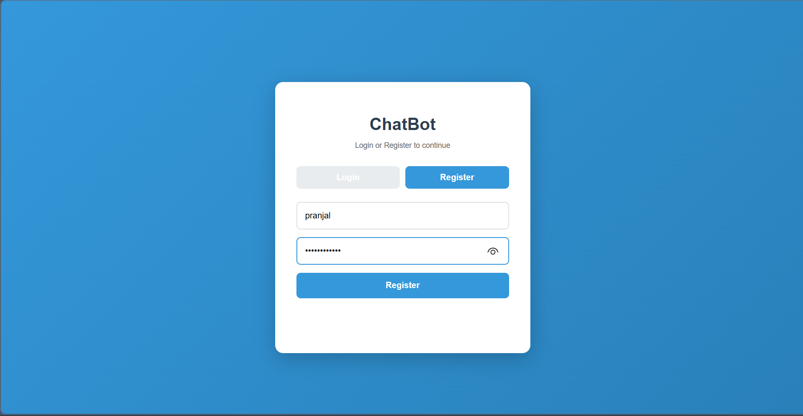
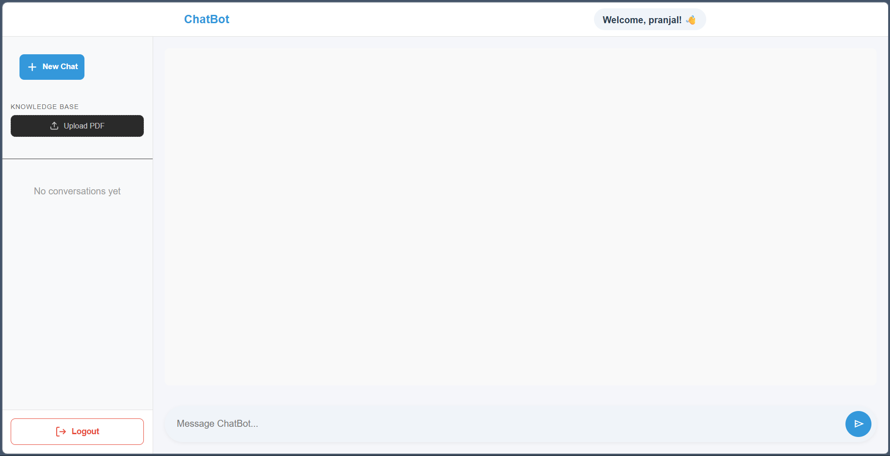
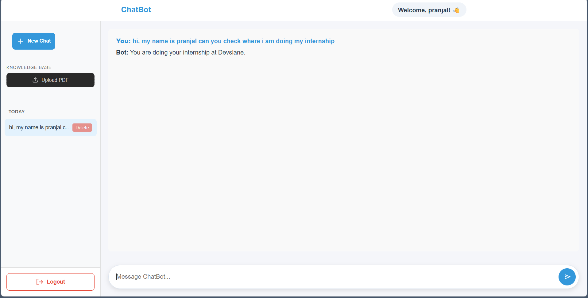

# Agentic RAG Chatbot - Internship Submission

**Submission by:** Gaurav
**Directory:** All project files are neatly contained within the `/rag_agent` folder to preserve the core Endee repository structure.

## Project Overview
This project is a agentic RAG (Retrieval-Augmented Generation) chatbot. It intelligently routes user queries, deciding whether to search uploaded documents using the **Endee Vector Database** or rely on its own parametric knowledge. It features full JWT user authentication, persistent chat histories, and dedicated long-term vector memory.

**Problem Statement:** Traditional LLMs lack private, domain-specific context, while standard RAG pipelines are often too rigid, blindly forcing database searches even when users ask casual or general questions. 
**Solution:** This project introduces an Agentic RAG chatbot. By treating database retrieval as an optional "tool" rather than a mandatory step, the AI intelligently routes user queries. It autonomously decides whether to search uploaded documents or rely on its own parametric knowledge, resulting in faster, more natural, and highly accurate conversations.

## How Endee is Used
As the core intelligence engine for document retrieval, the **Endee Vector Database** is utilized in two critical stages of the pipeline:
* **Dynamic Ingestion (`file_processor.py`):** When a user uploads a PDF, TXT, or DOCX, the backend chunks the document and generates embeddings using HuggingFace's `all-MiniLM-L6-v2`. These embeddings, along with their metadata (filename, user ID, raw text), are directly upserted into an Endee index (`endee_rag`) utilizing cosine similarity.
* **Semantic Retrieval (`tools.py`):** The LangGraph agent is equipped with a `search_knowledge_base` tool. When triggered, this tool converts the agent's search query into a vector and performs a `top_k=3` semantic search against the Endee database, returning the most relevant document chunks to ground the LLM's final answer.

## Architecture & Tech Stack
* **Backend:** FastAPI (Python)
* **Agent Framework:** LangGraph
* **LLM Engine:** Groq (`llama-3.3-70b-versatile`)
* **Primary RAG Database:** Endee (Dockerized)
* **Agentic Memory:** Mem0 powered by ChromaDB (Serverless Local Vector DB)
* **Relational Database:** SQLite (User Auth & Chat Threads)
* **Frontend:** Vanilla HTML, CSS, JavaScript

## Key Features
* **Agentic Tool Calling:** The LangGraph agent decides when to trigger the `search_knowledge_base` tool versus answering directly.
* **Multi-Tenant Security:** JWT-based authentication ensures users can only access their own documents and chat histories.
* **Dual-Memory System:** SQLite handles exact UI chat histories, while ChromaDB handles semantic long-term memory for the agent.
* **Dynamic Chunking:** Automatically processes, splits, and embeds PDFs, TXTs, and DOCXs into Endee.

---

## How to Run Locally

Follow these steps to get the Agentic RAG Chatbot running on your local machine. Ensure you have **Docker**, **Python 3.10+**, and **Git** installed before starting.

### 1. Clone the Repository
Clone the repository to your local machine

### 2.Install Dependencies
Go to the backend folder and install the required Python packages:

cd rag_agent/backend
pip install -r requirements.txt

(Also create a .env file that contain JWT_SECRET_KEY , GROQ_API_KEY and HUGGINGFACEHUB_API_TOKEN)

### 3.Start the Endee Vector Database
Ensure Docker Dekstop is running in background then go to rag_agent directory to run db by:
cd..(if currently in backend)
docker compose up -d

### 4.Run the Backend server:

cd backend
python server.py

now your server is running at http://127.0.0.1:5000

### 5.Launch the Frontend UI

Navigate to rag_agent/frontend/index.html.
Right-click and select "Open with Live Server" to launch the chat interface in your browser.

(Tip: Ensure your VS Code workspace ignores the local database files to prevent Live Server from automatically refreshing the page when the AI saves a message!)

### future work:
->Expand the Agent's Toolbelt: if we want to convert it to a full functional chatbot we have to make tools that can allow llm to do web search.
->Advanced RAG (Hybrid Search):Standard cosine similarity struggles with exact keyword matches (like finding a specific serial number). Upgrading the Endee query to use Hybrid Search.
->Total Containerization: Right now, only endee is in Docker, we can write a docker file for frontend and backend too.

### Project Showcase:

**1. login Page**

**2. First Thing**

**3. Demo**

